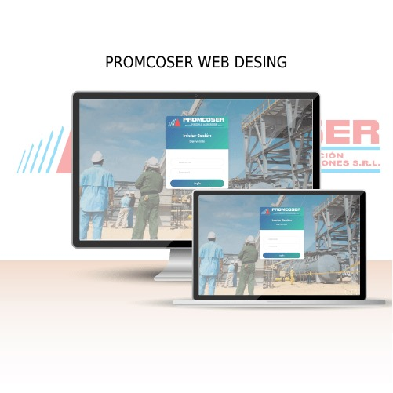

# 🎓 **Proyectos Presentados - Desarrollo Web**

Bienvenidos al repositorio de proyectos desarrollados por los estudiantes del curso **Desarrollo Web**. Aquí se documentan los trabajos presentados, sus descripciones, objetivos, y enlaces relevantes, además de incluir una imagen representativa de cada proyecto.

---

## 📋 **Índice**
1. [Introducción](#introducción)
2. [📂 Lista de Proyectos](#lista-de-proyectos)
3. [🔧 Instrucciones para Contribuir](#instrucciones-para-contribuir)
4. [📜 Licencia](#licencia)

---

## 📝 **Introducción**

Este repositorio recopila los proyectos desarrollados por los estudiantes de **Desarrollo Web** en los periodos **[Indicar Periodos: 2024-01, 2024-02, etc.]**. Cada proyecto tiene como objetivo aplicar los conocimientos adquiridos en clase y desarrollar habilidades prácticas.

Cada proyecto incluye:
- Una breve descripción.
- Ciclo en el que se cursó el curso.
- Objetivos específicos.
- Tecnologías utilizadas.
- Enlace al código fuente o demo (si aplica).
- Una imagen representativa.

---

## 📂 **Lista de Proyectos**

### **📌 PROMCOSER GRUPO 3**
- **👥 Autor(es):**
- Gerson Chancas Evangelista (21100940)
- Hernan Marecos Perez (21100534)
- Frayder Meza Morveli (22200142)
- Nilmar Angel Arones Chuchon (22200136)
- Aaron Steve Soto López (22101508)
- Rodrigo Cabello Espinoza (21100744)
- **📅 Ciclo:** 2024-02
- **📖 Descripción:** Página web para Promcoser que permita registrar y gestionar personal, maquinaria y clientes, así como digitalizar el Parte Diario para su llenado y almacenamiento en línea.
- **🎯 Objetivos:**
1.Desarrollar una plataforma web que facilite la gestión integral de personal, maquinaria y clientes, incorporando la digitalización del 'Parte Diario' para optimizar procesos internos.
2.Implementar una sección de reportes dentro de la plataforma, que permita realizar análisis eficientes mediante herramientas intuitivas, garantizando la seguridad de los datos mediante protocolos avanzados de autenticación y encriptación.
3.Optimizar la gestión operativa de PROMCOSER, generando ahorros de tiempo, minimizando errores y mejorando el acceso a información clave para la toma de decisiones.
- **🛠️ Tecnologías utilizadas:**
-Visual Studio (Backend): Desarrollo de la lógica del servidor, APIs y conexión a la base de datos.
-Visual Studio Code (Frontend): Creación de la interfaz de usuario con Quasar Framework.
-SQL Server: Diseño y gestión de la base de datos estructurada.
-Git y GitHub: Control de versiones y colaboración en el código.
-Google Drive: Almacenamiento y colaboración en documentos y archivos del proyecto.
-Google Meet: Comunicación para reuniones grupales y asignación de tareas.
-WhatsApp: Comunicación ágil para coordinación diaria y recordatorios.
- **🔗 Enlace al repositorio o demo:**
- API: https://github.com/GersonEvangelista/ProyectoPROMCOSERWeb.git
- FRONT: https://github.com/GersonEvangelista/ProyectoPROMCOSERWeb_Frontend.git
- **🖼️ Imagen representativa:**  
  
---

### **📌 [2. GRUPO 1]**
- **👥 Autor(es):**
  - Cardenas Gomez Jose
  - Carrera Muñoz Benny
  - Ccompi Guerrero Williams
  - Delgado Lorino Joaquín
  - Leon Cabanillas Sebastian
  - Ruiz Montes Rubén
- **📅 Ciclo:** 2024-2
- **📖 Descripción:** Página web para Promcoser que permita registrar y gestionar personal, maquinaria y clientes, así como digitalizar el Parte Diario para su llenado y almacenamiento en línea.
- **🎯 Objetivos:**
  1. Desarrollar una plataforma web que facilite la gestión integral de personal, maquinaria y clientes, incorporando la digitalización del 'Parte Diario' para optimizar procesos internos.
  2. Implementar una sección de reportes dentro de la plataforma, que permita realizar análisis eficientes mediante herramientas intuitivas, garantizando la seguridad de los datos mediante protocolos avanzados de autenticación y encriptación.
  3. [Optimizar la gestión operativa de PROMCOSER, generando ahorros de tiempo, minimizando errores y mejorando el acceso a información clave para la toma de decisiones.
- **🛠️ Tecnologías utilizadas:**
  1. Visual Studio (Backend): Desarrollo de la lógica del servidor, APIs y conexión a la base de datos.
  2. Visual Studio Code (Frontend): Creación de la interfaz de usuario con Quasar Framework.
  3. SQL Server: Diseño y gestión de la base de datos estructurada.
  4. Git y GitHub: Control de versiones y colaboración en el código.
  5. Google Drive: Almacenamiento y colaboración en documentos y archivos del proyecto.
  6. Google Meet: Comunicación para reuniones grupales y asignación de tareas.
  7. WhatsApp: Comunicación ágil para coordinación diaria y recordatorios.
- **🔗 Enlace al repositorio o demo:**
  1. Api: https://github.com/WilliamsCG57/PromcoserApp.git
  2. Front: https://github.com/JoawhiWebMovil/PromcoserWebFront.git
- **🖼️ Imagen representativa:**   
  

### **📌 [3. DPA GRUPO 1]**
- **👥 Autor(es):**
- Cano Diaz, Ruben Andres
- Cutimanco Huaco, William Vicente
- Delgado Diaz, Cesar Ruben
- Rodriguez Zelada, Fernando Andre
- Roldan Villanueva, Diego Osmar
- **📅 Ciclo:** 2024-2 (DPA)
- **📖 Descripción:** Página web para GreenCity, donde se podrán registrar reportes acerca de problemas delictivos o ambientales ocurridos en la ciudad. Asimismo, se podrán elaborar informes relacionados al reporte, estos informes podrán ser exportados en formato PDF o Excel.
- **🎯 Objetivos:**
1.Desarrollar una plataforma web que facilite al usuario realizar el reporte de los problemas que se han sucedido en Greencity.
2.Mostrar un listado de los reportes generados por los usuarios.
3.Permitir que el usuario "Administrador" pueda generar informes con base a los reportes generados, esta tabla de informes puede ser exportada en formato ".xlsx" o ".pdf".
- **🛠️ Tecnologías utilizadas:**
-Visual Studio (Backend): Desarrollo de la lógica del servidor, APIs y conexión a la base de datos.
-Visual Studio Code (Frontend): Creación de la interfaz de usuario con Quasar Framework.
-SQL Server: Diseño y gestión de la base de datos estructurada.
-Git y GitHub: Control de versiones y colaboración en el código.
-Google Drive: Almacenamiento y colaboración en documentos y archivos del proyecto.
-Google Meet: Comunicación para reuniones grupales y asignación de tareas.
-WhatsApp: Comunicación ágil para coordinación diaria y recordatorios.
- **🔗 Enlace al repositorio o demo:**
- API:https://github.com/wcutimanco/DPA.GreenCity.git 
- Front: https://github.com/Farz1093/GreenCity-Fe.git
- Base de datos (Backup):  https://github.com/Farz1093/GreenCityDB.git
- **🖼️ Imagen representativa:**  
  

### **📌 [3. DPA GRUPO 2]**
- **👥 Autor(es):**
- Cano Diaz, Ruben Andres
- Héctor Miguel Navarro Montano
- Andrea Lizeth Paniagua Escobar
- **📅 Ciclo:** 2024-2 (DPA)
- **📖 Descripción:** Página web para GreenCity, donde se podrán registrar reportes acerca de problemas delictivos o ambientales ocurridos en la ciudad. Asimismo, se podrán elaborar informes relacionados al reporte, estos informes podrán ser exportados en formato PDF o Excel.
- **🎯 Objetivos:**
1.Desarrollar una plataforma web que facilite al usuario realizar el reporte de los problemas que se han sucedido en Greencity.
2.Mostrar un listado de los reportes generados por los usuarios.
- **🛠️ Tecnologías utilizadas:**
-Visual Studio (Backend): Desarrollo de la lógica del servidor, APIs y conexión a la base de datos.
-Visual Studio Code (Frontend): Creación de la interfaz de usuario con Quasar Framework.
-SQL Server: Diseño y gestión de la base de datos estructurada.
-Git y GitHub: Control de versiones y colaboración en el código.
-Google Drive: Almacenamiento y colaboración en documentos y archivos del proyecto.
-Google Meet: Comunicación para reuniones grupales y asignación de tareas.
-WhatsApp: Comunicación ágil para coordinación diaria y recordatorios.
- **🔗 Enlace al repositorio o demo:**
- API:https://github.com/migueln15/green-city-be.git
- Front:https://github.com/andreapani01/green-city-fe.git
- **🖼️ Imagen representativa:**  
  

### **📌 [3. Pregrado GRUPO 2]**
- **👥 Autor(es):**
- Avila Agurto, Sandro Fabrizio Enrique
- Garay Santos, Jefferson David
- Medina Tello, Mijhail Jaffet
- Mantilla Huaman, Joe Jose
- **📅 Ciclo:** 2025-1 (Pregrado)
- **📖 Descripción:** Página web para el Vicerrectorado de Investigacion, donde se podran registrar publicaciones de investigaciones de profesor, para que alumnos y mas puedan tener vista a estos. Asimismo, se podrán elaborar informes relacionados al reporte de las propuestas hechas por los profesores, estos informes podrán ser exportados en formato Excel.
- **🎯 Objetivos:**
1.Desarrollar una plataforma web que facilite al profesor realizar el propuestas y mandar al administrador
2.Generacion de reportes de las propuestas que se tienen para analizar si acepta el tema de investigacion.
- **🛠️ Tecnologías utilizadas:**
-Visual Studio (Backend): Desarrollo de la lógica del servidor, APIs y conexión a la base de datos.
-Visual Studio Code (Frontend): Creación de la interfaz de usuario con Quasar Framework.
-SQL Server: Diseño y gestión de la base de datos estructurada.
-Git y GitHub: Control de versiones y colaboración en el código.
-Google Drive: Almacenamiento y colaboración en documentos y archivos del proyecto.
-Google Meet y Discord: Comunicación para reuniones grupales y asignación de tareas.
-WhatsApp: Comunicación ágil para coordinación diaria y recordatorios.
- **🔗 Enlace al repositorio o demo:**
- API:https://github.com/JeffersonDavidGaraySantos/UESAN_INTRANET_FINAL_DESARROLLO_WEB.git
- Frontend:https://github.com/J03-M4NT/UESAN.INVES_Frontend.git
- **🖼️ Imagen representativa:**  
  

### 📌 **[ Pregrado GRUPO 1]** 
👥 Autor(es): • GUIVAR FONSECA, Deivis Maycol • CASTRO MARQUINA, Jaime Sebastián • DEL CASTILLO MAMANI, José Daniel • FASABI RIVERA, Fabrissio Keith

📅 Ciclo: 2025-1 (Pregrado)

📖 Descripción:
Desarrollo de un prototipo de aplicación web para el Vicerrectorado de Investigación (VDI) que centraliza y facilita el acceso a servicios académicos y de gestión de investigación. Permitirá:
- Consulta de ISSN y listas de revistas recomendadas.
- Chat interactivo para resolver dudas sobre políticas y procedimientos.
- Importación y gestión de datos de profesores habilitados desde Excel o registro manual.
- Generación de reportes exportables en formato Excel.

🎯 Objetivos:

- Diseñar e implementar una interfaz intuitiva que reúna todos los servicios del VDI.
- Desarrollar módulos de consulta de revistas científicas (ISSN y lista cerrada).
- Integrar un chatbot para atención de consultas sobre investigación.
- Crear la funcionalidad de importación de datos de profesores y vista previa de registros.
- Generar reportes personalizables y exportables en Excel para análisis administrativo.

🛠️ Tecnologías utilizadas:

- Visual Studio 2022 (Backend): ASP.NET Core Web API para lógica de negocio y gestión de datos.
- VS Code (Frontend): Desarrollo de UI con Vue.js y Quasar Framework.
- SQL Server: Diseño y administración de la base de datos relacional.
- GitHub: Control de versiones y gestión colaborativa del código.
- Slack: Comunicación y coordinación del equipo de trabajo.

🔗 Repositorios:

- API: https://github.com/DeivisGFUwU/UESAN.VDI.git
- Frontend: https://github.com/DeivisGFUwU/UESAN.VDI.FRONTEND.git

- **🖼️ Imagen representativa:**  
  

---

### **📌 [3. Pregrado GRUPO 3]**
👥 Autor(es):

-Quiliche Chavez, Andrés (Líder del Proyecto) - @23-Andres-QC
-Vergara Morales, Eduardo (Frontend Lead) - @eduvm107
-Perales Ramos, Alex (UI/UX Developer) - @Alexper7
-Salazar Cruz, Jehu (Developer) - @Jehu-Salazar
-Ramos Castillo, Glem (Backend Support) - @glemrc
📅 Ciclo: 2025-1 (Desarrollo Web Avanzado)

📖 Descripción: Sistema web integral para la gestión y visualización de datos académicos del Vicerrectorado de Investigación. La plataforma permite el registro, importación y gestión de revistas académicas, listas cerradas de profesores, y generación de reportes estadísticos. Incluye un sistema de autenticación robusto, ChatBot interactivo con FAQ, y funcionalidades completas de importación/exportación de datos en múltiples formatos. El sistema está diseñado con una interfaz moderna y responsiva que se adapta a todos los dispositivos.

🎯 Objetivos:

Desarrollar una plataforma web moderna que facilite la gestión integral de datos académicos y de investigación
Implementar un sistema de visualización avanzado para reportes y estadísticas institucionales
Crear herramientas de importación/exportación eficientes para el manejo masivo de datos
Establecer un sistema de autenticación seguro con recuperación de contraseñas por correo electrónico
Proporcionar una interfaz intuitiva con ChatBot de soporte y FAQ para usuarios
Garantizar diseño responsivo optimizado para dispositivos móviles, tablets y desktop
🛠️ Tecnologías utilizadas:

Vue.js 3 (Frontend): Framework principal para el desarrollo de la interfaz de usuario (92.3% del código)
Quasar Framework: Biblioteca de componentes UI para Vue.js, garantizando diseño Material Design
JavaScript ES6+: Lógica de aplicación y funcionalidades interactivas (5.9% del código)
CSS3 Moderno: Estilos avanzados con flexbox, grid y animaciones (1.4% del código)
HTML5: Estructura semántica de la aplicación (0.4% del código)
Node.js: Entorno de ejecución para herramientas de desarrollo
Git y GitHub: Control de versiones distribuido y colaboración en equipo
Email.js: Servicio de envío de correos para recuperación de contraseñas
Visual Studio Code: IDE principal para desarrollo frontend
GitHub Actions: CI/CD para automatización de despliegues
Responsive Design: Adaptación automática a múltiples dispositivos

🔗 Enlaces al repositorio y documentación:

Frontend Principal: https://github.com/23-Andres-QC/Proyecto_VDI_FRONTED
Documentación del Proyecto: https://github.com/23-Andres-QC/ProyectoFinalWEB

Pull Requests: 49 completados exitosamente
Commits: 100+ commits bien documentados
Estado: ✅ PROYECTO COMPLETADO (4 Julio 2025)

📊 Estadísticas del Proyecto:

Duración: 26 días (8 Jun - 4 Jul 2025)
Colaboradores: 5 desarrolladores activos
Pull Requests: 49 mergeados + 1 en review
Líneas de código: Vue.js (92.3%), JavaScript (5.9%), CSS (1.4%), HTML (0.4%)
Última actualización: 4 Jul 2025, 21:52:14 UTC

🎨 Características Principales:

✅ Sistema de Autenticación Completo (Login, registro, recuperación de contraseña)
✅ Gestión de Revistas Académicas (CRUD completo con validaciones)
✅ Gestión de Listas Cerradas de Profesores (Importación masiva y individual)
✅ Sistema de Reportes Avanzado (Visualización y exportación en múltiples formatos)
✅ ChatBot Interactivo (Soporte 24/7 con sistema de FAQ integrado)
✅ Importación/Exportación de Datos (Excel, CSV, PDF)
✅ Diseño Responsivo (Optimizado para móviles, tablets y desktop)
✅ Tablas Dinámicas (QTable de Quasar con paginación y filtros)
✅ Iconografía Personalizada (SVG optimizados para redes sociales)
✅ Animaciones Fluidas (Carga, transiciones y micro-interacciones)
👨‍💻 Contribuciones por Desarrollador:

Eduardo Vergara (@eduvm107) - Frontend Lead [25% del proyecto]:
Andrés Quiliche (@23-Andres-QC) - Project Lead [25% del proyecto]:
Alex Perales (@Alexper7) - UI/UX Developer [20% del proyecto]:
Jehu Salazar (@Jehu-Salazar) - Developer [20% del proyecto]:
Glem Ramos (@glemrc) - Backend Support [10% del proyecto]:

🏆 Logros y Reconocimientos:

✅ Proyecto completado en tiempo récord (26 días)
✅ Calidad de código excepcional (100+ commits documentados)
✅ Trabajo en equipo sobresaliente (5 desarrolladores coordinados)
✅ Implementación 100% de funcionalidades requeridas
✅ Tecnología de vanguardia (Vue.js 3 + Quasar Framework)
✅ Performance optimizada (Carga rápida y responsive)
✅ Testing exitoso en múltiples dispositivos

🖼️ Imagen representativa:

---

## 📜 **Licencia**

Este repositorio está protegido bajo la licencia **[Nombre de la Licencia, ej. MIT]**. Consulta el archivo [LICENSE](LICENSE) para más detalles.

---
